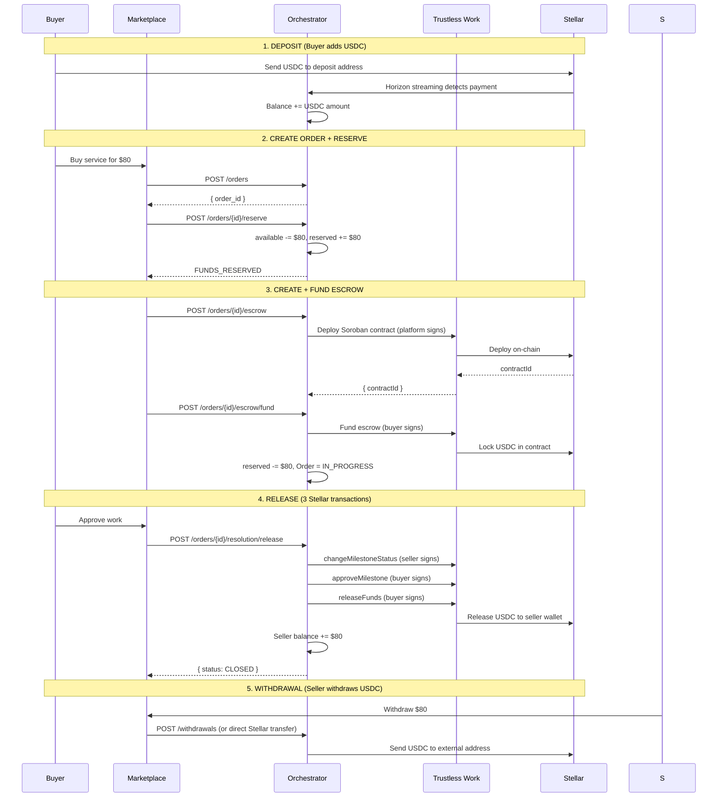
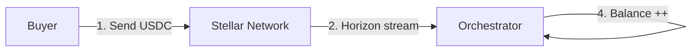
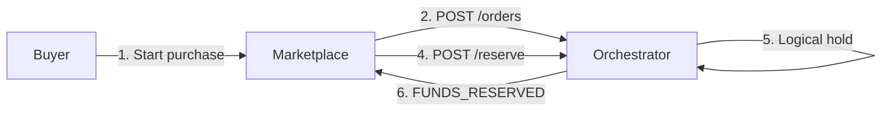
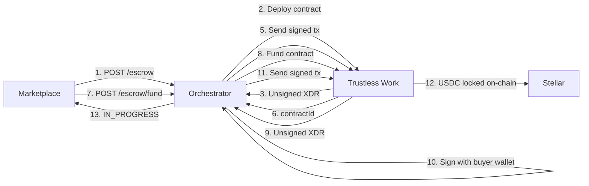
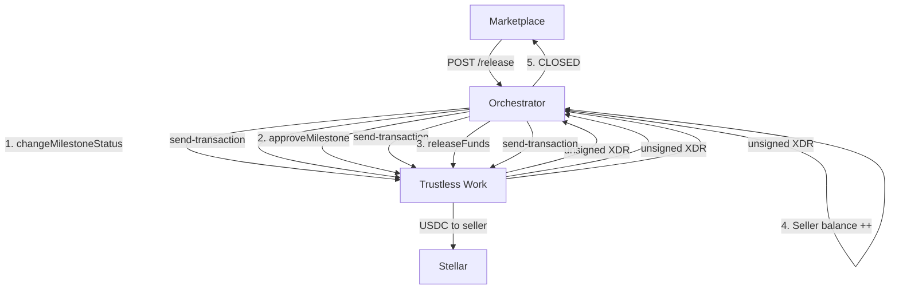
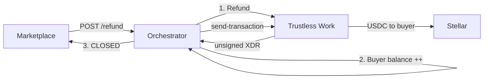
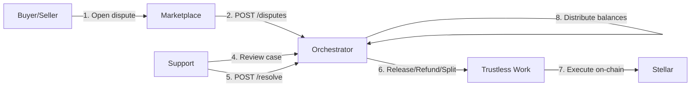
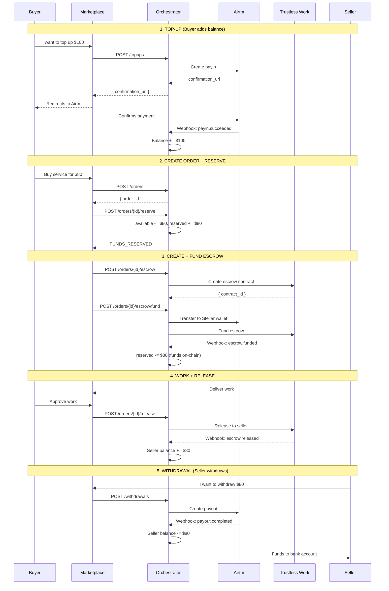

# Flow of Funds

The Orchestrator supports two payment providers via the Strategy Pattern. Set `PAYMENT_PROVIDER=crypto` (default) or `PAYMENT_PROVIDER=airtm` in your environment.

## Crypto-Native Flow (Default)

Uses invisible Stellar wallets and Trustless Work smart contracts for non-custodial escrow.


```mermaid
sequenceDiagram
    participant B as Buyer
    participant MP as Marketplace
    participant ORC as Orchestrator
    participant TW as Trustless Work
    participant ST as Stellar

    Note over B,ST: 1. DEPOSIT (Buyer adds USDC)
    B->>ST: Send USDC to deposit address
    ST->>ORC: Horizon streaming detects payment
    ORC->>ORC: Balance += USDC amount

    Note over B,ST: 2. CREATE ORDER + RESERVE
    B->>MP: Buy service for $80
    MP->>ORC: POST /orders
    ORC-->>MP: { order_id }
    MP->>ORC: POST /orders/{id}/reserve
    ORC->>ORC: available -= $80, reserved += $80
    ORC-->>MP: FUNDS_RESERVED

    Note over B,ST: 3. CREATE + FUND ESCROW
    MP->>ORC: POST /orders/{id}/escrow
    ORC->>TW: Deploy Soroban contract (platform signs)
    TW->>ST: Deploy on-chain
    ST-->>TW: contractId
    TW-->>ORC: { contractId }
    MP->>ORC: POST /orders/{id}/escrow/fund
    ORC->>TW: Fund escrow (buyer signs)
    TW->>ST: Lock USDC in contract
    ORC->>ORC: reserved -= $80, Order = IN_PROGRESS

    Note over B,ST: 4. RELEASE (3 Stellar transactions)
    B->>MP: Approve work
    MP->>ORC: POST /orders/{id}/resolution/release
    ORC->>TW: changeMilestoneStatus (seller signs)
    ORC->>TW: approveMilestone (buyer signs)
    ORC->>TW: releaseFunds (buyer signs)
    TW->>ST: Release USDC to seller wallet
    ORC->>ORC: Seller balance += $80
    ORC-->>MP: { status: CLOSED }

    Note over B,ST: 5. WITHDRAWAL (Seller withdraws USDC)
    S->>MP: Withdraw $80
    MP->>ORC: POST /withdrawals (or direct Stellar transfer)
    ORC->>ST: Send USDC to external address
```

### Crypto-Native Phase Detail

#### Phase 1: Deposit (Add Balance)

The buyer deposits USDC to their Orchestrator deposit address (a Stellar public key).


```mermaid
flowchart LR
    A[Buyer] -->|1. Send USDC| B[Stellar Network]
    B -->|2. Horizon stream| C[Orchestrator]
    C -->|3. Detect deposit| C
    C -->|4. Balance ++| C
```

**Money flow:**
- Buyer sends USDC from any Stellar wallet or exchange
- BlockchainMonitorService detects the incoming payment via Horizon streaming
- Buyer's available balance increases in the Orchestrator

#### Phase 2: Create Order + Reserve Funds

Same as AirTM flow -- purely internal balance operations.


```mermaid
flowchart LR
    A[Buyer] -->|1. Start purchase| B[Marketplace]
    B -->|2. POST /orders| C[Orchestrator]
    C -->|3. Create order| C
    B -->|4. POST /reserve| C
    C -->|5. Logical hold| C
    C -->|6. FUNDS_RESERVED| B
```

**Money flow:**
- No real money movement
- Only a logical hold in the database
- `available -= amount`, `reserved += amount`

#### Phase 3: Create and Fund Escrow (On-Chain)

Reserved funds move to the non-custodial Trustless Work smart contract on Stellar.


```mermaid
flowchart LR
    A[Marketplace] -->|1. POST /escrow| B[Orchestrator]
    B -->|2. Deploy contract| C[Trustless Work]
    C -->|3. Unsigned XDR| B
    B -->|4. Sign with platform wallet| B
    B -->|5. Send signed tx| C
    C -->|6. contractId| B
    A -->|7. POST /escrow/fund| B
    B -->|8. Fund contract| C
    C -->|9. Unsigned XDR| B
    B -->|10. Sign with buyer wallet| B
    B -->|11. Send signed tx| C
    C -->|12. USDC locked on-chain| D[Stellar]
    B -->|13. IN_PROGRESS| A
```

**Money flow:**
- Orchestrator deploys a Soroban smart contract via Trustless Work
- Platform wallet signs the deploy transaction
- Buyer's invisible wallet funds the contract with USDC
- Funds are now locked on-chain in the smart contract
- `reserved -= amount` (funds are now on-chain, not in Orchestrator)

**Order states:**
```
FUNDS_RESERVED -> ESCROW_FUNDING -> IN_PROGRESS (escrow FUNDED)
```

#### Phase 4a: Release (Pay Seller) -- 3 On-Chain Transactions

The buyer approves work and the Orchestrator executes three Stellar transactions to release funds.


```mermaid
flowchart TD
    A[Marketplace] -->|POST /release| B[Orchestrator]
    B -->|1. changeMilestoneStatus| C[Trustless Work]
    C -->|unsigned XDR| B
    B -->|sign with SELLER wallet| B
    B -->|send-transaction| C
    B -->|2. approveMilestone| C
    C -->|unsigned XDR| B
    B -->|sign with BUYER wallet| B
    B -->|send-transaction| C
    B -->|3. releaseFunds| C
    C -->|unsigned XDR| B
    B -->|sign with BUYER wallet| B
    B -->|send-transaction| C
    C -->|USDC to seller| D[Stellar]
    B -->|4. Seller balance ++| B
    B -->|5. CLOSED| A
```

**Money flow:**
- Smart contract releases USDC to seller's Stellar wallet
- Orchestrator credits seller's internal balance
- Order transitions to CLOSED

**Transaction signers:**
1. `changeMilestoneStatus` -- **Seller** (serviceProvider role)
2. `approveMilestone` -- **Buyer** (approver role)
3. `releaseFunds` -- **Buyer** (releaseSigner role)

#### Phase 4b: Refund (Return to Buyer)


```mermaid
flowchart LR
    A[Marketplace] -->|POST /refund| B[Orchestrator]
    B -->|1. Refund| C[Trustless Work]
    C -->|unsigned XDR| B
    B -->|sign with buyer wallet| B
    B -->|send-transaction| C
    C -->|USDC to buyer| D[Stellar]
    B -->|2. Buyer balance ++| B
    B -->|3. CLOSED| A
```

#### Phase 4c: Dispute + Resolution


```mermaid
flowchart LR
    A[Buyer/Seller] -->|1. Open dispute| B[Marketplace]
    B -->|2. POST /disputes| C[Orchestrator]
    C -->|3. Freeze order| C
    E[Support] -->|4. Review case| C
    E -->|5. POST /resolve| C
    C -->|6. Release/Refund/Split| D[Trustless Work]
    D -->|7. Execute on-chain| F[Stellar]
    C -->|8. Distribute balances| C
```

---

## AirTM Flow (Legacy/Alternative)

Uses AirTM as custodial payment provider. Requires Enterprise AirTM account.

Set `PAYMENT_PROVIDER=airtm` to use this flow.


```mermaid
sequenceDiagram
    participant B as Buyer
    participant MP as Marketplace
    participant ORC as Orchestrator
    participant AIRTM as Airtm
    participant TW as Trustless Work
    participant S as Seller

    Note over B,S: 1. TOP-UP (Buyer adds balance)
    B->>MP: I want to top up $100
    MP->>ORC: POST /topups
    ORC->>AIRTM: Create payin
    AIRTM-->>ORC: confirmation_uri
    ORC-->>MP: { confirmation_uri }
    MP-->>B: Redirects to Airtm
    B->>AIRTM: Confirms payment
    AIRTM->>ORC: Webhook: payin.succeeded
    ORC->>ORC: Balance += $100

    Note over B,S: 2. CREATE ORDER + RESERVE
    B->>MP: Buy service for $80
    MP->>ORC: POST /orders
    ORC-->>MP: { order_id }
    MP->>ORC: POST /orders/{id}/reserve
    ORC->>ORC: available -= $80, reserved += $80
    ORC-->>MP: FUNDS_RESERVED

    Note over B,S: 3. CREATE + FUND ESCROW
    MP->>ORC: POST /orders/{id}/escrow
    ORC->>TW: Create escrow contract
    TW-->>ORC: { contract_id }
    MP->>ORC: POST /orders/{id}/escrow/fund
    ORC->>AIRTM: Transfer to Stellar wallet
    ORC->>TW: Fund escrow
    TW-->>ORC: Webhook: escrow.funded
    ORC->>ORC: reserved -= $80 (funds on-chain)

    Note over B,S: 4. WORK + RELEASE
    S->>MP: Deliver work
    B->>MP: Approve work
    MP->>ORC: POST /orders/{id}/release
    ORC->>TW: Release to seller
    TW-->>ORC: Webhook: escrow.released
    ORC->>ORC: Seller balance += $80

    Note over B,S: 5. WITHDRAWAL (Seller withdraws)
    S->>MP: I want to withdraw $80
    MP->>ORC: POST /withdrawals
    ORC->>AIRTM: Create payout
    AIRTM-->>ORC: Webhook: payout.completed
    ORC->>ORC: Seller balance -= $80
    AIRTM->>S: Funds to bank account
```

---

## Balance Summary

### Buyer Balance (Crypto-Native)

| Operation | available | reserved | on-chain |
|-----------|-----------|----------|----------|
| Initial state | 0.00 | 0.00 | 0.00 |
| Deposit 100 USDC | +100.00 | 0.00 | 0.00 |
| Reserve $80 (order) | -80.00 | +80.00 | 0.00 |
| Fund escrow | 0.00 | -80.00 | +80.00 |
| **After release** | **20.00** | **0.00** | **0.00** |
| **After refund** | **100.00** | **0.00** | **0.00** |

### Seller Balance

| Operation | available |
|-----------|-----------|
| Initial state | 0.00 |
| Release $80 | +80.00 |
| Withdrawal $80 | -80.00 |
| **Final** | **0.00** |

---

## Key Differences: Crypto vs AirTM

| Feature | Crypto-Native | AirTM |
|---------|--------------|-------|
| Deposit | Direct USDC transfer to Stellar address | Fiat payin via AirTM (redirect) |
| Withdrawal | Direct Stellar USDC transfer | Fiat payout via AirTM |
| Escrow signing | Server-side (invisible wallets) | N/A (AirTM handles) |
| Webhooks | Not used (synchronous) | Required (AirTM callbacks) |
| KYC | None (blockchain-native) | AirTM KYC required |
| Settlement currency | USDC (Stellar) | USD (AirTM) |
| Release process | 3 on-chain txns (milestone + approve + release) | Single API call |

## Key Points

1. **Funds are never held by the Orchestrator**: They are in user wallets (Stellar) or locked in smart contracts (Trustless Work)
2. **Escrow is non-custodial**: The Orchestrator signs transactions but funds are on-chain
3. **Balance is a mirror**: The Orchestrator tracks state; the source of truth is on-chain
4. **Reconciliation**: Workers verify consistency between internal state and blockchain
5. **All TW amounts are in USDC**: Never send stroops to the Trustless Work API
