# Escrow Lifecycle (Crypto-Native)

Complete end-to-end escrow lifecycle using Trustless Work on the Stellar blockchain.

**Status:** Verified on Stellar Testnet (February 2026)

## Overview

The Orchestrator manages the full escrow lifecycle for marketplace transactions. When `PAYMENT_PROVIDER=crypto`, all escrow operations are executed on-chain via Trustless Work smart contracts on Stellar, using USDC as the settlement currency.

### Key Design Decisions

- **Invisible Wallets:** Users never interact with browser wallets. The Orchestrator creates and manages Stellar keypairs server-side, encrypted with AES-256-GCM.
- **Non-Custodial Escrow:** Funds are locked in Trustless Work smart contracts on Stellar. The Orchestrator orchestrates but never holds funds directly.
- **Synchronous State Transitions:** The Orchestrator does NOT depend on webhooks from Trustless Work. All state transitions happen immediately after successful API calls.
- **Strategy Pattern:** The `PaymentProvider` interface allows switching between `crypto` and `airtm` providers via environment configuration.

## Complete Flow Diagram

```mermaid
sequenceDiagram
    participant MP as Marketplace
    participant ORC as Orchestrator
    participant TW as Trustless Work API
    participant ST as Stellar Blockchain

    Note over MP,ST: 1. CREATE ORDER
    MP->>ORC: POST /orders
    ORC-->>MP: { order_id, status: ORDER_CREATED }

    Note over MP,ST: 2. RESERVE FUNDS
    MP->>ORC: POST /orders/{id}/reserve
    ORC->>ORC: available -= amount, reserved += amount
    ORC-->>MP: { status: FUNDS_RESERVED }

    Note over MP,ST: 3. DEPLOY ESCROW CONTRACT
    MP->>ORC: POST /orders/{id}/escrow
    ORC->>TW: POST /deployer/single-release
    TW-->>ORC: { unsignedTransaction }
    ORC->>ORC: Sign with platform wallet
    ORC->>TW: POST /helper/send-transaction
    TW->>ST: Deploy Soroban contract
    ST-->>TW: contractId
    TW-->>ORC: { status: SUCCESS, contractId }
    ORC->>ORC: Save escrow (CREATED)
    ORC-->>MP: { status: ESCROW_FUNDING, contractId }

    Note over MP,ST: 4. FUND ESCROW
    MP->>ORC: POST /orders/{id}/escrow/fund
    ORC->>ORC: Deduct from reserved balance
    ORC->>TW: POST /escrow/single-release/fund-escrow
    TW-->>ORC: { unsignedTransaction }
    ORC->>ORC: Sign with buyer wallet
    ORC->>TW: POST /helper/send-transaction
    TW->>ST: Transfer USDC to contract
    ST-->>TW: confirmed
    TW-->>ORC: { status: SUCCESS }
    ORC->>ORC: Escrow = FUNDED, Order = IN_PROGRESS
    ORC-->>MP: { status: IN_PROGRESS }

    Note over MP,ST: 5. RELEASE FUNDS (3-step process)
    MP->>ORC: POST /orders/{id}/resolution/release

    rect rgb(240, 248, 255)
        Note over ORC,ST: Step 5a: Complete Milestone (seller signs)
        ORC->>TW: POST /escrow/.../change-milestone-status
        TW-->>ORC: { unsignedTransaction }
        ORC->>ORC: Sign with seller wallet
        ORC->>TW: POST /helper/send-transaction
        TW->>ST: Mark milestone completed
    end

    rect rgb(240, 255, 240)
        Note over ORC,ST: Step 5b: Approve Milestone (buyer signs)
        ORC->>TW: POST /escrow/.../approve-milestone
        TW-->>ORC: { unsignedTransaction }
        ORC->>ORC: Sign with buyer wallet
        ORC->>TW: POST /helper/send-transaction
        TW->>ST: Approve milestone
    end

    rect rgb(255, 248, 240)
        Note over ORC,ST: Step 5c: Release Funds (buyer signs)
        ORC->>TW: POST /escrow/.../release-funds
        TW-->>ORC: { unsignedTransaction }
        ORC->>ORC: Sign with buyer wallet
        ORC->>TW: POST /helper/send-transaction
        TW->>ST: Release USDC to seller
        ST-->>TW: confirmed
    end

    ORC->>ORC: Seller balance += amount
    ORC->>ORC: Order = CLOSED
    ORC-->>MP: { status: CLOSED }

    Note over MP,ST: 6. REFUND (alternative to release, 2-step process)
    MP->>ORC: POST /orders/{id}/resolution/refund

    rect rgb(255, 240, 240)
        Note over ORC,ST: Step 6a: Dispute Escrow (buyer signs)
        ORC->>TW: POST /escrow/.../dispute-escrow
        TW-->>ORC: { unsignedTransaction }
        ORC->>ORC: Sign with buyer wallet
        ORC->>TW: POST /helper/send-transaction
        TW->>ST: Flag escrow as disputed
    end

    rect rgb(255, 255, 240)
        Note over ORC,ST: Step 6b: Resolve Dispute 100% to buyer (platform signs)
        ORC->>TW: POST /escrow/.../resolve-dispute
        TW-->>ORC: { unsignedTransaction }
        ORC->>ORC: Sign with platform wallet (disputeResolver)
        ORC->>TW: POST /helper/send-transaction
        TW->>ST: Release USDC to buyer
        ST-->>TW: confirmed
    end

    ORC->>ORC: Buyer balance += amount
    ORC->>ORC: Order = CLOSED
    ORC-->>MP: { status: CLOSED }

    Note over MP,ST: 7. SPLIT RESOLUTION (dispute → distribute to both parties)
    MP->>ORC: POST /disputes/{id}/resolve (decision: SPLIT)

    rect rgb(255, 240, 240)
        Note over ORC,ST: Step 7a: Dispute Escrow (buyer signs)
        ORC->>TW: POST /escrow/.../dispute-escrow
        TW-->>ORC: { unsignedTransaction }
        ORC->>ORC: Sign with buyer wallet
        ORC->>TW: POST /helper/send-transaction
        TW->>ST: Flag escrow as disputed
    end

    rect rgb(240, 240, 255)
        Note over ORC,ST: Step 7b: Resolve Dispute with split distributions (platform signs)
        ORC->>TW: POST /escrow/.../resolve-dispute
        Note right of ORC: distributions: [{seller, $X}, {buyer, $Y}]
        TW-->>ORC: { unsignedTransaction }
        ORC->>ORC: Sign with platform wallet (disputeResolver)
        ORC->>TW: POST /helper/send-transaction
        TW->>ST: Distribute USDC to both parties
        ST-->>TW: confirmed
    end

    ORC->>ORC: Seller balance += releaseAmount
    ORC->>ORC: Buyer balance += refundAmount
    ORC->>ORC: Order = CLOSED
    ORC-->>MP: { status: CLOSED }
```



## Order State Transitions

```
ORDER_CREATED
    │
    ▼
FUNDS_RESERVED ──────► CANCELLED (if buyer cancels)
    │
    ▼
ESCROW_FUNDING
    │
    ▼
IN_PROGRESS (escrow FUNDED)
    │
    ├──────────────────────────────────────┐
    ▼                                      ▼
RELEASE_REQUESTED                    REFUND_REQUESTED
    │                                      │
    ▼                                      ▼
CLOSED (funds to seller)             CLOSED (funds to buyer)
    │
    ├──► DISPUTED ──► CLOSED (split resolution)
```

## API Endpoints Reference

### 1. Create Order

```http
POST /api/v1/orders
```

```json
{
    "buyer_id": "usr_...",
    "seller_id": "usr_...",
    "service_id": "svc_...",
    "title": "Service Title",
    "amount": "100.00",
    "currency": "USDC"
}
```

**Response:** `{ status: "ORDER_CREATED", escrow: null }`

### 2. Reserve Funds

```http
POST /api/v1/orders/{id}/reserve
```

No body required. Deducts from buyer's available balance to reserved.

**Response:** `{ status: "FUNDS_RESERVED" }`

### 3. Create Escrow

```http
POST /api/v1/orders/{id}/escrow
```

No body required. The Orchestrator:
1. Gets buyer and seller Stellar addresses from their wallets
2. Calls TW API to deploy a Soroban smart contract
3. Signs the deploy transaction with the platform wallet
4. Submits to Stellar via TW's send-transaction endpoint
5. Stores the `contractId` in the escrow record

**Response:** `{ status: "ESCROW_FUNDING", escrow: { contractId: "C...", status: "CREATED" } }`

### 4. Fund Escrow

```http
POST /api/v1/orders/{id}/escrow/fund
```

No body required. The Orchestrator:
1. Deducts from buyer's reserved balance
2. Calls TW fund-escrow with the USDC amount
3. Signs with buyer's invisible wallet
4. Submits to Stellar
5. Transitions order to `IN_PROGRESS`

**Response:** `{ status: "IN_PROGRESS", escrow: { status: "FUNDED" } }`

### 5. Release Funds

```http
POST /api/v1/orders/{id}/resolution/release
```

```json
{
    "requestedBy": "usr_...",
    "reason": "Work completed"
}
```

The Orchestrator executes 3 on-chain transactions:
1. **changeMilestoneStatus** -- Seller marks work as complete (signed by seller)
2. **approveMilestone** -- Buyer approves the milestone (signed by buyer)
3. **releaseFunds** -- Buyer releases USDC to seller (signed by buyer)

Then credits the seller's balance and closes the order.

**Response:** `{ status: "CLOSED" }`

### 6. Refund (Alternative to Release)

```http
POST /api/v1/orders/{id}/resolution/refund
```

```json
{
    "reason": "Service not delivered"
}
```

Trustless Work does **not** have a direct `/refund` endpoint. Refunds require a 2-step process:

1. **Dispute escrow** -- Buyer disputes the contract (signed by buyer)
2. **Resolve dispute** -- Platform resolves with 100% distribution to buyer (signed by platform as `disputeResolver`)

This is why the escrow contract assigns the **platform wallet** as `disputeResolver` (not the buyer). TW enforces that the `disputeResolver` cannot be the same address as the disputer.

**Response:** `{ status: "CLOSED" }`

## Escrow Role Assignments

When deploying an escrow contract, the Orchestrator assigns roles as follows:

| TW Role | Assigned To | Purpose |
|---------|-------------|---------|
| `approver` | Buyer | Approves milestones |
| `serviceProvider` | Seller | Delivers work, marks milestones |
| `platformAddress` | Platform (`PLATFORM_USER_ID`) | Receives platform fees |
| `releaseSigner` | Buyer | Authorizes fund release |
| `disputeResolver` | Platform (`PLATFORM_USER_ID`) | Resolves disputes (must differ from disputer) |
| `receiver` | Seller | Receives released funds |

> **Important:** `disputeResolver` MUST be a different address from the buyer. If the buyer is the disputer and also the `disputeResolver`, the TW smart contract will reject the transaction with: `"The dispute resolver cannot dispute the escrow"`.

## Trustless Work API Endpoints Used

| Orchestrator Step | TW Endpoint | Signer |
|-------------------|-------------|--------|
| Deploy escrow | `POST /deployer/single-release` | Platform |
| Fund escrow | `POST /escrow/single-release/fund-escrow` | Buyer |
| Mark milestone complete | `POST /escrow/single-release/change-milestone-status` | Seller |
| Approve milestone | `POST /escrow/single-release/approve-milestone` | Buyer |
| Release funds | `POST /escrow/single-release/release-funds` | Buyer |
| Dispute escrow (refund step 1) | `POST /escrow/single-release/dispute-escrow` | Buyer |
| Resolve dispute (refund step 2) | `POST /escrow/single-release/resolve-dispute` | Platform |
| Dispute escrow (split step 1) | `POST /escrow/single-release/dispute-escrow` | Buyer |
| Resolve dispute with split (split step 2) | `POST /escrow/single-release/resolve-dispute` | Platform |
| Submit signed tx | `POST /helper/send-transaction` | N/A |

## Amount Format

All amounts sent to Trustless Work are in **USDC** (human-readable numbers):

```
Orchestrator "100.00" --> parseFloat --> TW API: 100
```

**Do NOT convert to stroops.** TW handles internal conversions.

| Context | Format | Example |
|---------|--------|---------|
| Orchestrator DB | String, 2 decimals | `"100.00"` |
| TW API | Number (USDC) | `100` |
| Stellar on-chain | Stroops (auto) | `1000000000` |

## Invisible Wallet Architecture

```
┌─────────────────────────────────────────────┐
│            Orchestrator Server               │
│                                              │
│  ┌─────────────┐    ┌───────────────────┐   │
│  │ WalletService│    │ CryptoNativeProvider│ │
│  │              │    │                   │   │
│  │ createWallet │    │ signEscrowTx()    │   │
│  │ getKeypair() │───▶│ getDepositInfo()  │   │
│  │ encrypt/     │    │ isUserReady()     │   │
│  │ decrypt keys │    │ getBalance()      │   │
│  └─────────────┘    └───────────────────┘   │
│         │                                    │
│  ┌──────▼──────┐                             │
│  │   Database   │  encrypted_secret_key      │
│  │   (Wallet)   │  AES-256-GCM               │
│  └─────────────┘                             │
└─────────────────────────────────────────────┘
```

Each user gets a Stellar keypair on registration:
- **Public key:** Stored in plain text (used as deposit address)
- **Secret key:** Encrypted with AES-256-GCM using `WALLET_ENCRYPTION_KEY`
- **USDC Trustline:** Automatically configured on wallet creation

## Transaction Retry Logic

The `sendTransaction` method includes retry logic for transient Stellar errors:

```
Attempt 1: Submit signed XDR
  └─ If "resultMetaXdr" or "not complete yet" error:
     Wait 3s → Attempt 2
       └─ Wait 6s → Attempt 3 (final)
```

## Events Emitted

| Event | When |
|-------|------|
| `order.created` | Order created |
| `order.funds_reserved` | Balance reserved |
| `order.escrow_creating` | Escrow deployed on Stellar |
| `order.escrow_funded` | Escrow funded with USDC |
| `order.release_requested` | Release initiated |
| `order.released` | Funds released to seller |
| `order.closed` | Order finalized |
| `balance.reserved` | Buyer balance reserved |
| `balance.released` | Balance operation completed |
| `balance.credited` | Seller balance credited |

## Testing on Testnet

### Prerequisites

1. Stellar testnet wallets with USDC trustline
2. USDC balance (use Stellar Laboratory to issue test USDC)
3. TW API key from https://dapp.trustlesswork.com
4. `PAYMENT_PROVIDER=crypto` in `.env`

### Quick Test Script

```bash
API_KEY="ohk_live_..."
BASE="http://localhost:4000/api/v1"

# 1. Create order
ORDER=$(curl -s -X POST $BASE/orders \
  -H "Content-Type: application/json" \
  -H "x-api-key: $API_KEY" \
  -d '{
    "buyer_id": "usr_buyer",
    "seller_id": "usr_seller",
    "service_id": "svc_test",
    "title": "Test Escrow",
    "amount": "1.00",
    "currency": "USDC"
  }' | jq -r '.data.data.id')

echo "Order: $ORDER"

# 2. Reserve
curl -s -X POST $BASE/orders/$ORDER/reserve -H "x-api-key: $API_KEY" | jq .

# 3. Create escrow
curl -s -X POST $BASE/orders/$ORDER/escrow -H "x-api-key: $API_KEY" | jq .

# 4. Fund escrow
curl -s -X POST $BASE/orders/$ORDER/escrow/fund -H "x-api-key: $API_KEY" | jq .

# 5a. Release (pay seller)
curl -s -X POST $BASE/orders/$ORDER/resolution/release \
  -H "Content-Type: application/json" \
  -H "x-api-key: $API_KEY" \
  -d '{"requestedBy": "usr_buyer", "reason": "Work completed"}' | jq .

# 5b. OR Refund (return to buyer) -- 2-step: dispute + resolve
curl -s -X POST $BASE/orders/$ORDER/resolution/refund \
  -H "Content-Type: application/json" \
  -H "x-api-key: $API_KEY" \
  -d '{"reason": "Service not delivered"}' | jq .
```

## E2E Test Results (Stellar Testnet)

### Cancel Order Flow -- Verified 2026-02-18

| Test | Endpoint | Result |
|------|----------|--------|
| Cancel from ORDER_CREATED | `POST /orders/{id}/cancel` | `CLOSED` (no balance change) |
| Cancel from FUNDS_RESERVED | `POST /orders/{id}/cancel` | `CLOSED` (buyer balance restored) |
| Cancel from ESCROW_FUNDING | `POST /orders/{id}/cancel` | `INVALID_STATE` (rejected) ✅ |

**Note:** Cancel is only allowed from `ORDER_CREATED` or `FUNDS_RESERVED` states. Once escrow is initiated, the order cannot be cancelled.

### Release Flow -- Verified 2026-02-17

| Step | Endpoint | Result |
|------|----------|--------|
| Create order | `POST /api/v1/orders` | `ORDER_CREATED` |
| Reserve funds | `POST /orders/{id}/reserve` | `FUNDS_RESERVED` |
| Create escrow | `POST /orders/{id}/escrow` | `ESCROW_FUNDING` |
| Fund escrow | `POST /orders/{id}/escrow/fund` | `IN_PROGRESS` |
| Release | `POST /orders/{id}/resolution/release` | `CLOSED` |

### Refund Flow -- Verified 2026-02-17

| Step | Endpoint | Result |
|------|----------|--------|
| Create order | `POST /api/v1/orders` | `ORDER_CREATED` |
| Reserve funds | `POST /orders/{id}/reserve` | `FUNDS_RESERVED` |
| Create escrow | `POST /orders/{id}/escrow` | `ESCROW_FUNDING` (contract: `CBL3SW...`) |
| Fund escrow | `POST /orders/{id}/escrow/fund` | `IN_PROGRESS` (escrow: `FUNDED`) |
| Refund | `POST /orders/{id}/resolution/refund` | `CLOSED` (dispute + resolve-dispute) |

**Test data:**
- Order: `ord_pQ85Prp0TPhyHK9JejuwDP8xsoGyf1Og`
- Contract: `CBL3SWJMMSE3KPIQDZJ7R4VDNWL3E6PWPBVOPSJTYKEW2GP2NYJWLHVE`
- Buyer wallet: `GCV24WNJYX6QC3RX7QBB5GYE66YRDJPU6A4RKMRS33CDDTMWLQDA7Y27`
- Platform wallet (disputeResolver): `GDGLXLBOS4DQYDIC3XAHUXXWWEB4OFPFHG2D2KL6AHTZ6W3KC2VTZW4J`

### Dispute → FULL_RELEASE Resolution Flow -- Verified 2026-02-18

| Step | Endpoint | Result |
|------|----------|--------|
| Create order | `POST /api/v1/orders` | `ORDER_CREATED` |
| Reserve funds | `POST /orders/{id}/reserve` | `FUNDS_RESERVED` |
| Create escrow | `POST /orders/{id}/escrow` | `ESCROW_FUNDING` (contract: `CB62PA...`) |
| Fund escrow | `POST /orders/{id}/escrow/fund` | `IN_PROGRESS` (escrow: `FUNDED`) |
| Open dispute | `POST /orders/{id}/resolution/dispute` | `OPEN` (dispute: `dsp_vowF...`) |
| Assign dispute | `POST /disputes/{id}/assign` | `UNDER_REVIEW` |
| Resolve FULL_RELEASE | `POST /disputes/{id}/resolve` | `RESOLVED` (decision: `FULL_RELEASE`) |
| **Final state** | -- | Order: `CLOSED`, Dispute: `RESOLVED` |

**Full release:** 100% ($5.00) released to seller via FULL_RELEASE decision.

**API note:** `POST /orders/{id}/resolution/dispute` requires `openedBy: "BUYER"|"SELLER"` (enum), not a user ID.

**Test data:**
- Order: `ord_hZfeQXPZTeX42WWx7FsZ7FJkxjrTHVf2`
- Dispute: `dsp_vowFmmgMK7O1h4BSGctQH8zJetcuvSNa`
- Contract: `CB62PACFHN7HMNYFMU3Z6GJ3WNWG44ZFUTJPYH5KFCYFIFT6TLQ7WHLG`
- Buyer wallet: `GCV24WNJYX6QC3RX7QBB5GYE66YRDJPU6A4RKMRS33CDDTMWLQDA7Y27`
- Seller wallet: `GDWXCMZTP6DVDBJY54NSNPH4CBOEUMVRMSY2XRG4VBSDYORMHJK4QOC3`

### Dispute → FULL_REFUND Resolution Flow -- Verified 2026-02-18

| Step | Endpoint | Result |
|------|----------|--------|
| Create order | `POST /api/v1/orders` | `ORDER_CREATED` |
| Reserve funds | `POST /orders/{id}/reserve` | `FUNDS_RESERVED` |
| Create escrow | `POST /orders/{id}/escrow` | `ESCROW_FUNDING` (contract: `CDAEJ3...`) |
| Fund escrow | `POST /orders/{id}/escrow/fund` | `IN_PROGRESS` (escrow: `FUNDED`) |
| Open dispute | `POST /orders/{id}/resolution/dispute` | `OPEN` (dispute: `dsp_zWAF...`) |
| Assign dispute | `POST /disputes/{id}/assign` | `UNDER_REVIEW` |
| Resolve FULL_REFUND | `POST /disputes/{id}/resolve` | `RESOLVED` (decision: `FULL_REFUND`) |
| **Final state** | -- | Order: `CLOSED`, Dispute: `RESOLVED` |

**Full refund:** 100% ($2.00) returned to buyer via FULL_REFUND decision.

**Test data:**
- Order: `ord_PVTgqAMDqI8v1oOLdcozzqmnWQXNzpCK`
- Dispute: `dsp_zWAFVtrXWPOlUru2NYWkxRkGfIaf1LGk`
- Contract: `CDAEJ3DS2ZF5ZXBPBGZX7C6VTID5237Z3MUCQFKTKGULDXOUWS4FDNJR`
- Buyer wallet: `GCV24WNJYX6QC3RX7QBB5GYE66YRDJPU6A4RKMRS33CDDTMWLQDA7Y27`
- Platform wallet (disputeResolver): `GDGLXLBOS4DQYDIC3XAHUXXWWEB4OFPFHG2D2KL6AHTZ6W3KC2VTZW4J`

### Dispute → SPLIT Resolution Flow -- Verified 2026-02-17

| Step | Endpoint | Result |
|------|----------|--------|
| Create order | `POST /api/v1/orders` | `ORDER_CREATED` |
| Reserve funds | `POST /orders/{id}/reserve` | `FUNDS_RESERVED` |
| Create escrow | `POST /orders/{id}/escrow` | `ESCROW_FUNDING` (contract: `CAKRHV...`) |
| Fund escrow | `POST /orders/{id}/escrow/fund` | `IN_PROGRESS` (escrow: `FUNDED`) |
| Open dispute | `POST /api/v1/disputes` | `OPEN` (openedBy: `BUYER`) |
| Assign dispute | `POST /disputes/{id}/assign` | `UNDER_REVIEW` |
| Resolve SPLIT | `POST /disputes/{id}/resolve` | `RESOLVED` (decision: `SPLIT`) |
| **Final state** | -- | Order: `CLOSED`, Escrow: `RELEASED` |

**Split details:** $6.00 to seller + $4.00 refund to buyer (from $10.00 total)

**Test data:**
- Order: `ord_hvfMNSBGzdiFDzS89qZMmAz06sMU8BJs`
- Dispute: `dsp_VbusoJ8bzdOwncUjKvGKQS79YnA6RF0G`
- Contract: `CAKRHVIA7KKNXVC5XDSWIKDAF4HDMDJJ2B6DNUYUTQEPUJP5YN7E5YH3`
- Buyer wallet: `GCV24WNJYX6QC3RX7QBB5GYE66YRDJPU6A4RKMRS33CDDTMWLQDA7Y27`
- Seller wallet: `GDWXCMZTP6DVDBJY54NSNPH4CBOEUMVRMSY2XRG4VBSDYORMHJK4QOC3`
- Platform wallet (disputeResolver): `GDGLXLBOS4DQYDIC3XAHUXXWWEB4OFPFHG2D2KL6AHTZ6W3KC2VTZW4J`

### Crypto-Native Withdrawal Flow -- Verified 2026-02-18

| Step | Endpoint | Result |
|------|----------|--------|
| Withdraw USDC | `POST /withdrawals` | `WITHDRAWAL_COMPLETED` (immediate, synchronous) |
| Verify balance | `GET /users/:id/balance` | `available` deducted correctly |

**Withdrawal details:** $5.00 sent from seller wallet directly to destination Stellar address via `paymentProvider.sendPayment()`.

**Key behavior:** `destinationType: "crypto"` triggers the sync path — no commit step, completes in one call.

**Test data:**
- Withdrawal: `wd_VSx3RjKlanuOOFa0i4FJXk4OhmtaAxZP`
- Seller userId: `usr_9DUCBnLofU9lLK88aIbfV3QEAcebHS8o`
- Seller wallet: `GDWXCMZTP6DVDBJY54NSNPH4CBOEUMVRMSY2XRG4VBSDYORMHJK4QOC3`
- Destination: `GCV24WNJYX6QC3RX7QBB5GYE66YRDJPU6A4RKMRS33CDDTMWLQDA7Y27`
- Balance before: `$12.00` → after: `$7.00`

### Unit Tests -- All Passing

```
Test Suites: 17 passed, 17 total
Tests:       154 passed, 154 total
Time:        7.504 s
```

## Related Documentation

- [Trustless Work Module](../../apps/api/src/providers/trustless-work/README.md) -- Technical integration details
- [Flow of Funds](../architecture/flow-of-funds.md) -- Money movement diagrams
- [Crypto-Native Architecture](./architecture.md) -- System design
- [Wallet Strategy](./wallet-strategy.md) -- Why invisible wallets
- [Provider Interface](./provider-interface.md) -- Strategy pattern spec
